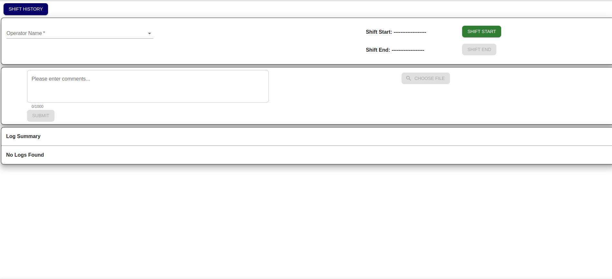
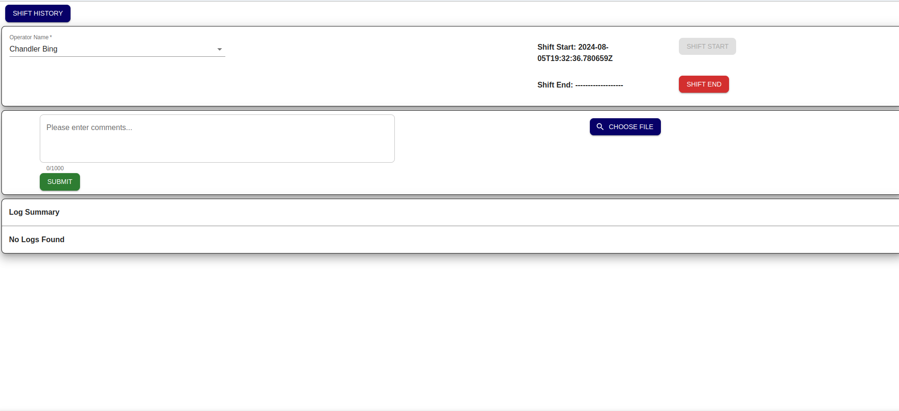
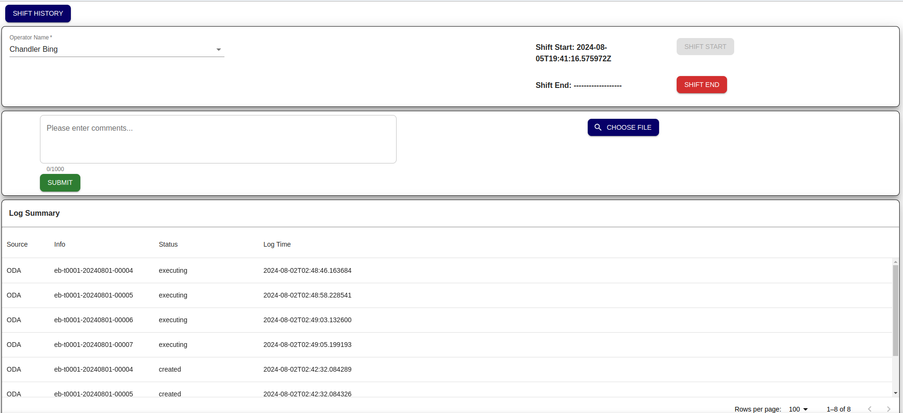
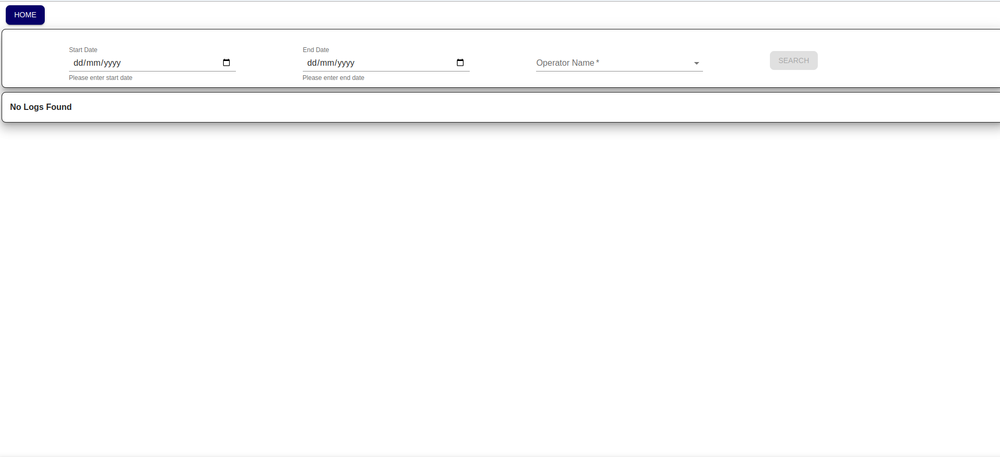
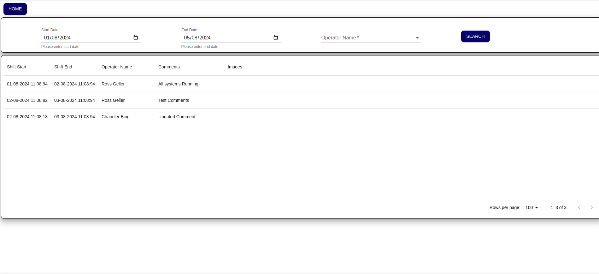

SKA OSO Shift Log Tool (SLT) UI
~~~~~~~~~~~~~~~~~~~~~~~~~~~~~~~~~~~~~~~~~~~~~~~~~~~~

The Shift Log Tool (SLT) is one of the main tools in the OSO suite and will find use in the early AIV and commissioning phases of the telescopes. 
An early first version will allow feedback on its appearance and features before entering real use in AA0.5.

This is a initial UI flow for Shift Log Tool where user will be able to query ODA, Log DB and EDA to view the logs and details for system logs and EB.
User will be able to search Shift by a Start Date and End Date and also by operator name.

Log Page (Home Page)
==========================================

Buttons for starting Shift and Ending Shift. also button for navigating to Shift history page.
Text entry field for comments, button for uploading media file (Images) for now.
also submit button for submitting comments and all the data.

when user will go to Home Page only ``Shift Start`` button will be enabled.

|

After clicking ``Shift Start`` button remaining buttons ``Shift End``, ``Submit`` and ``File Upload`` will be enabled.

|

after clicking ``Shift End`` button ``Home Page`` will be refreshed and only ``Shift Start`` button will be enabled.

|

.. note::

    Log Summery section will be updated every 5 Seconds.

Shift History Page
============================================

User will be able to search Shift by a Start Date and End Date and also by operator name. after clicking search button a table with 

``Shift Start``, ``Shift End``, ``Operator Name`` and ``Source``, ``Log Message``, ``Comments`` and ``Images`` will be populated.

|

|

